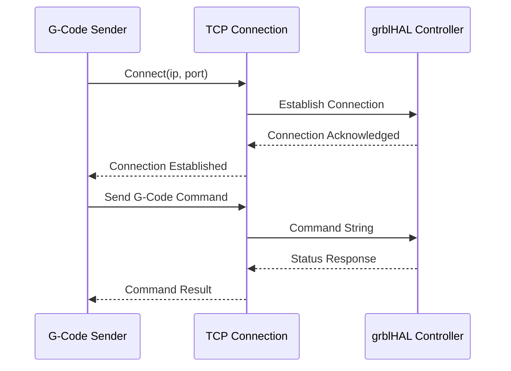

# Documentation Strategy and Standards

**Author**: Technical Writer & System Architect  
**Date**: 2025-07-13  
**Purpose**: Define comprehensive documentation strategy, standards, and implementation approach for the G-Code sender project

## Documentation Mission Statement

Our documentation strategy follows the **"Docs as Code"** philosophy to create a self-documenting codebase that enables autonomous development, reduces onboarding time, and provides comprehensive support for users and developers at all skill levels.

## Core Documentation Principles

### 1. Self-Documenting Codebase
- **Every public API must have comprehensive documentation**
- **Code should be readable and self-explanatory**
- **Complex algorithms require implementation comments**
- **Error conditions and exceptions must be documented**
- **Performance characteristics noted for critical paths**

### 2. Documentation as Code
- **Documentation lives alongside code in version control**
- **Automated generation and deployment of documentation**
- **Documentation updates required for all code changes**
- **Quality gates enforce documentation standards**
- **Continuous integration for documentation validation**

### 3. Multi-Audience Support
- **End Users**: Clear workflows and troubleshooting guides
- **Developers**: API documentation and implementation guides
- **System Administrators**: Deployment and configuration guides
- **Contributors**: Development setup and contribution guidelines

### 4. Progressive Disclosure
- **Beginner-friendly entry points with advanced details available**
- **Quick reference guides for experts**
- **Contextual help and guidance within the application**
- **Learning paths that grow with user competency**

## Documentation Architecture

### Primary Documentation Outputs

**Note on 'context' folder**: The `context` folder contains external projects imported to provide additional reference and understanding for agents. Files within these sub-directories are considered external context and are not part of the project's official documentation. They should not be treated as project documentation or subject to the same documentation standards.

#### 1. API Reference Documentation
**Generated from**: Source code using framework-native documentation tools  
**Target Audience**: Developers integrating with or extending the system  
**Hosted at**: `/api-docs/` subdirectory  
**Update Frequency**: Automatically on every commit  

**Standards**:
- Every public interface, class, method, and function must have comprehensive inline documentation
- Include usage examples for all public APIs
- Document all parameters, return values, and error conditions
- Cross-reference related components and modules
- Include performance notes for critical operations
- Follow language-specific documentation conventions (JSDoc for TypeScript, dartdoc for Dart, etc.)

#### 2. User Documentation
**Generated from**: Markdown files using MkDocs Material  
**Target Audience**: End users, CNC operators, workshop managers  
**Hosted at**: ReadTheDocs.io primary site  
**Update Frequency**: Weekly releases with hotfixes as needed  

**Content Areas**:
- Getting started guides and tutorials
- Workflow documentation (from `/docs/workflows/`)
- Troubleshooting and FAQ
- Feature reference and configuration
- Safety guidelines and best practices

#### 3. Developer Documentation
**Generated from**: Markdown with embedded diagrams  
**Target Audience**: Contributors, integrators, system architects  
**Hosted at**: `/dev-docs/` subdirectory  
**Update Frequency**: Automatically on architecture changes  

**Content Areas**:
- Architecture overview and design decisions
- Development environment setup
- Contribution guidelines and standards
- Testing strategy and quality gates
- Deployment and release procedures
- Observability strategy and instrumentation (`docs/analysis/OBSERVABILITY.md`)

#### 4. Security Documentation
**Generated from**: Specialized security templates  
**Target Audience**: Security teams, compliance officers, auditors  
**Hosted at**: Private documentation site (access controlled)  
**Update Frequency**: Quarterly reviews with immediate updates for incidents  

**Content Areas**:
- Threat model and risk assessments
- Security architecture and controls
- Incident response procedures
- Compliance mapping and audit trails
- Secure coding guidelines

### Documentation Toolchain

#### Primary Tools and Technologies
```yaml
Documentation Stack:
  Code Documentation: 
    - Framework-native tools (JSDoc/TypeDoc for TypeScript, dartdoc for Dart, etc.)
    - Inline source code comments following language conventions
  
  User Documentation:
    - Static site generator (MkDocs Material, GitBook, or similar)
    - Markdown with embedded diagrams (Mermaid, PlantUML)
    - Hosted documentation platform (ReadTheDocs.io, Netlify, or similar)
  
  Architecture Documentation:
    - Diagram-as-code tools (Mermaid, PlantUML, or similar)
    - Architecture Decision Records (ADRs) in Markdown
    - System design documents with embedded diagrams
  
  Quality Assurance:
    - Link validation tools (markdown-link-check or equivalent)
    - Content quality tools (spelling, grammar, style checking)
    - Inclusive language validation
    - Automated accessibility testing

Deployment Pipeline Requirements:
  Triggers:
    - Push to main/develop branches
    - Pull requests affecting documentation or source code
    - Manual deployment for hotfixes
  
  Process:
    1. Generate API documentation using framework-appropriate tools
    2. Build user documentation using chosen static site generator
    3. Validate links, content quality, and accessibility
    4. Deploy to documentation hosting platforms
    5. Update search indices and navigation
```

#### Continuous Integration for Documentation
```yaml
# Framework-agnostic documentation pipeline template
# Adapt commands based on chosen technology stack

name: Documentation Build and Quality Check

on:
  push:
    branches: [main, develop]
  pull_request:
    paths: ['docs/**', 'src/**/*', '*.md']

jobs:
  documentation:
    runs-on: ubuntu-latest
    steps:
      # API Documentation Generation
      - name: Generate API Documentation
        run: |
          # Install dependencies for chosen framework
          # npm install (for TypeScript) OR flutter packages get (for Dart)
          
          # Generate API docs using framework-appropriate tool
          # npm run docs (for TypeDoc/JSDoc) OR dart doc (for Dart)
          
      # User Documentation Build
      - name: Build User Documentation
        run: |
          # Install static site generator
          # pip install mkdocs mkdocs-material OR npm install -g gitbook-cli
          
          # Build documentation site
          # mkdocs build --strict OR gitbook build
          
      # Quality Checks
      - name: Check Documentation Quality
        run: |
          # Link validation (framework-agnostic)
          markdown-link-check docs/**/*.md
          
          # Content quality checks (framework-agnostic)
          # Spelling, grammar, inclusive language, style consistency
          
      # Deployment
      - name: Deploy Documentation
        if: github.ref == 'refs/heads/main'
        run: |
          # Deploy to chosen hosting platform
          # Examples: GitHub Pages, Netlify, ReadTheDocs, etc.
```

## Documentation Standards by Content Type

### 1. Source Code Documentation

#### Universal Code Documentation Principles
All source code documentation must follow these framework-agnostic principles:

**Class/Interface Documentation Requirements:**
- Brief one-line description of purpose
- Detailed explanation of responsibilities and capabilities
- Usage patterns and integration points
- Performance characteristics and limitations
- Cross-references to related components
- Complete usage examples in the target language

**Method/Function Documentation Requirements:**
- Clear description of purpose and behavior
- All parameters documented with types and constraints
- Return value description and possible values
- Error conditions and exception types
- Side effects and state changes
- When to use this method vs alternatives
- Code examples demonstrating typical usage

**Error/Exception Documentation Requirements:**
- Clear description of when the error occurs
- Common causes and triggering conditions
- Recovery strategies and troubleshooting steps
- Diagnostic information included
- Related errors and escalation paths

#### Framework-Specific Implementation Examples

**TypeScript/JavaScript (JSDoc)**
```typescript
/**
 * Manages CNC machine connection and communication with grblHAL controllers.
 * 
 * This service handles:
 * - TCP/IP connection establishment and management
 * - Command queue processing with priority handling
 * - Real-time status updates and state synchronization
 * - Error handling and automatic reconnection
 * 
 * @example
 * ```typescript
 * const machine = new MachineConnectionService();
 * await machine.connect('192.168.1.100', 23);
 * machine.sendCommand(new GCodeCommand('G28'));
 * ```
 * 
 * @see {@link GCodeCommand} for command construction
 * @see {@link MachineState} for status monitoring
 */
class MachineConnectionService {
  /**
   * Establishes connection to grblHAL controller.
   * 
   * @param ipAddress - Valid IPv4 address
   * @param port - Port number (typically 23 for grblHAL telnet)
   * @throws {ConnectionException} When connection fails
   * @throws {ValidationException} When parameters are invalid
   */
  async connect(ipAddress: string, port: number): Promise<void> {
    // Implementation...
  }
}
```

**Dart (dartdoc)**
```dart
/// Manages CNC machine connection and communication with grblHAL controllers.
/// 
/// This service handles:
/// - TCP/IP connection establishment and management  
/// - Command queue processing with priority handling
/// - Real-time status updates and state synchronization
/// - Error handling and automatic reconnection
/// 
/// Example:
/// ```dart
/// final machine = MachineConnectionService();
/// await machine.connect('192.168.1.100', 23);
/// machine.sendCommand(GCodeCommand.homeAll());
/// ```
/// 
/// See also:
/// - [GCodeCommand] for command construction
/// - [MachineState] for status monitoring
class MachineConnectionService {
  /// Establishes connection to grblHAL controller.
  /// 
  /// [ipAddress] must be a valid IPv4 address
  /// [port] typically 23 for grblHAL telnet interface
  /// 
  /// Throws [ConnectionException] if connection fails
  /// Throws [ValidationException] if parameters are invalid
  Future<void> connect(String ipAddress, int port) async {
    // Implementation...
  }
}
```

### 2. Architecture Documentation Standards

#### Architecture Decision Record (ADR) Template
```markdown
# ADR-NNN: Title of Decision

## Status
- Proposed | Accepted | Deprecated | Superseded

## Context
- What is the issue that we're seeing that is motivating this decision or change?
- What are the forces at play?
- What are the constraints we're operating under?

## Decision
- What is the change that we're proposing and/or doing?
- Why is this the right solution?

## Consequences
- What becomes easier or more difficult to do because of this change?
- What are the positive and negative outcomes?
- How does this affect other parts of the system?

## Implementation Notes
- Key implementation considerations
- Migration strategy if applicable
- Timeline and dependencies

## References
- Links to related ADRs
- External documentation
- Discussion threads or meetings
```

#### System Integration Documentation
```markdown
# Service Integration: Machine Controller Communication

## Overview
This document describes the integration between the G-Code sender application
and grblHAL controllers, including protocol specification, error handling,
and performance considerations.

## Architecture Diagram


## Protocol Specification
- Connection: TCP/IP on port 23 (telnet)
- Encoding: ASCII text with CRLF line endings
- Command format: Standard G-Code with grblHAL extensions
- Response format: JSON status messages + plain text acknowledgments

## Error Handling Strategy
- Connection timeouts: 30 second initial, 5 second keepalive
- Retry logic: Exponential backoff up to 3 attempts
- Graceful degradation: Queue commands locally if connection lost
- Recovery procedures: Automatic reconnection with state sync

## Performance Characteristics
- Typical latency: <50ms for command acknowledgment
- Throughput: 1000+ commands per minute sustainable
- Memory usage: <1MB for command queue and status tracking
- CPU usage: <5% during normal operation
```

### 3. User Documentation Standards

#### Workflow Documentation Template
```markdown
# Workflow Title

**Purpose**: Clear statement of what this workflow accomplishes
**Audience**: Who should use this workflow (Beginner/Intermediate/Expert)
**Prerequisites**: What must be done before starting this workflow
**Estimated Time**: How long this workflow typically takes

## Overview
Brief description of the workflow and its place in the larger process.

## Step-by-Step Instructions

### Step 1: Descriptive Step Name
**Goal**: What this step accomplishes

1. **Action**: Specific instruction with UI elements referenced
   - Click the [Start Job] button in the execution panel
   - Verify the machine status shows "Ready"
   - Confirm all safety systems are active

2. **Verification**: How to confirm the step was successful
   - Machine status should change to "Running"
   - Progress bar should begin advancing
   - Spindle should start (if programmed)

**Troubleshooting**:
- **Problem**: Status shows "Alarm" instead of "Running"
- **Solution**: Check emergency stop button and machine limits
- **See Also**: [Emergency Stop Recovery Workflow]

### Step 2: Next Step
[Continue with similar format...]

## Common Issues and Solutions
- **Issue**: Specific problem description
- **Cause**: Why this happens
- **Solution**: Step-by-step resolution
- **Prevention**: How to avoid in the future

## Related Workflows
- [Previous Workflow]: What comes before this
- [Next Workflow]: What typically follows this
- [Alternative Workflow]: When to use a different approach

## Safety Considerations
- Critical safety points highlighted throughout
- Emergency procedures clearly marked
- Risk mitigation strategies explained
```

### 4. API Documentation Standards

#### External API Documentation Requirements
For any external APIs (REST, GraphQL, WebSocket, etc.), documentation must include:

**API Overview Documentation:**
- Clear description of API purpose and capabilities
- Authentication and authorization requirements
- Rate limiting and usage guidelines
- Error handling and status codes
- Versioning strategy and backward compatibility

**Endpoint/Operation Documentation:**
- Clear description of functionality
- All parameters with types, constraints, and examples
- Response format and schema documentation
- Error conditions and troubleshooting
- Usage examples in multiple languages/tools
- Performance characteristics and limitations

**Example Documentation Structure:**
```yaml
# Framework-agnostic API documentation example
# Can be implemented using OpenAPI, GraphQL Schema, or custom documentation

API: Machine Status Endpoint
Purpose: Get current machine status including position, state, and coordinate systems

Parameters:
  - include_history: boolean (optional) - Include recent status history
  - format: string (optional) - Response format preference

Response Format:
  - state: string - Current machine state (Idle, Run, Alarm, etc.)
  - position: object - Current coordinates in machine and work coordinate systems
  - timestamp: string - ISO 8601 timestamp of last status update
  - metadata: object - Additional status information

Usage Guidelines:
  - Maximum poll frequency: 10Hz to avoid performance impact
  - Authentication required for all endpoints
  - Rate limited to 1000 requests per minute per client

Error Conditions:
  - 401: Authentication required
  - 429: Rate limit exceeded
  - 503: Machine not connected

Example Response:
{
  "state": "Idle",
  "position": {
    "machine": { "x": 0.0, "y": 0.0, "z": 0.0 },
    "work": { "x": 0.0, "y": 0.0, "z": 0.0 }
  },
  "timestamp": "2025-07-13T10:30:00Z"
}
```

## Quality Assurance and Metrics

### Documentation Quality Metrics
- **API Coverage**: >95% of public APIs documented
- **Link Validity**: 100% of internal links functional
- **Content Freshness**: <30 days since last update for active features
- **User Task Completion**: >90% success rate following documentation
- **Developer Onboarding**: New developers productive within 2 days

### Review and Validation Process
1. **Automated Checks**: Spelling, grammar, links, formatting
2. **Peer Review**: Technical accuracy by domain experts
3. **User Testing**: Task completion with actual documentation
4. **Accessibility Audit**: Screen reader and navigation testing
5. **Performance Testing**: Documentation site load times

### Maintenance Schedule
- **Daily**: Automated quality checks on all PRs
- **Weekly**: User feedback review and issue triage
- **Monthly**: Content audit and gap analysis
- **Quarterly**: Comprehensive review and strategy adjustment

## Implementation Roadmap

### Phase 1: Foundation (Weeks 1-2)
- Set up documentation toolchain and CI/CD
- Establish coding standards and templates
- Create initial architecture documentation
- Implement automated quality checks

### Phase 2: Core Content (Weeks 3-6)
- Generate comprehensive API documentation
- Create user workflow documentation
- Develop troubleshooting guides
- Establish security documentation framework

### Phase 3: Enhancement (Weeks 7-8)
- Add interactive examples and tutorials
- Implement search and navigation improvements
- Create onboarding paths for different user types
- Establish documentation analytics and feedback systems

### Phase 4: Optimization (Ongoing)
- Continuous improvement based on user feedback
- Performance optimization and mobile responsiveness
- Advanced features like documentation chatbots
- Integration with support and learning systems

This documentation strategy ensures that our G-Code sender project becomes truly self-documenting, enabling autonomous development while maintaining the highest standards of quality and usability.